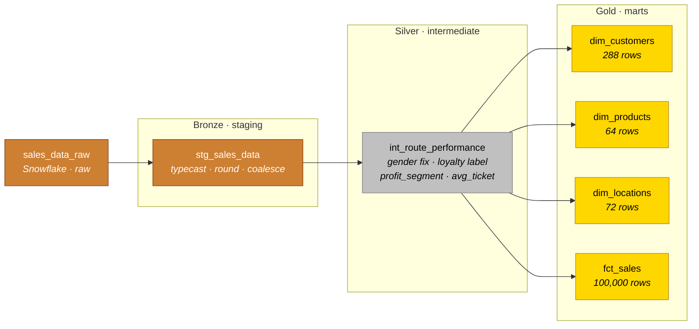

# Step 2 — dbt (transformation layer)

> Bronze → Silver → Gold transformation of the raw invoice feed into a clean star schema. Reads from `FMCG_RTM.raw.sales_data_raw`, writes 6 models into 3 schemas.

---

## Project at a glance

| | |
|---|---|
| **Project name** | `fmcg_rtm_mexico_analytics` |
| **Adapter** | Snowflake (`dbt-snowflake`) |
| **Profile name** | `default` (template: [`profiles.yml.template`](profiles.yml.template)) |
| **dbt-core version** | 1.7+ |
| **Packages** | `dbt-labs/dbt_utils 1.1.0` (used by all 4 marts for `generate_surrogate_key`) |
| **Materialization** | All layers as `view` (see [Design notes](#design-notes) for why) |

---

## Medallion architecture



**Bronze (`stg_*`)** — single-table cleanup: cast types, round currency, coalesce nulls, standardize string casing. No business logic, no joins.

**Silver (`int_*`)** — business rules at row grain: gender remapping (`'O'` → `'M'`), loyalty flag → label, profit segmentation thresholds, derived `avg_ticket_price`. One row per invoice line, enriched.

**Gold (`dim_*`, `fct_*`)** — star-schema marts. Surrogate keys (MD5) for each dim, DISTINCT for dimension dedupe, full grain on the fact.

---

## Model inventory

| Model | Layer | Materialization | Schema | Grain | Output rows |
|---|---|---|---|---|---|
| `stg_sales_data` | Bronze | view | `staging` | 1 row / invoice line | 100,000 |
| `int_route_performance` | Silver | view | `intermediate` | 1 row / invoice line | 100,000 |
| `dim_customers` | Gold | view | `marts` | 1 row / customer-profile | 288 |
| `dim_products` | Gold | view | `marts` | 1 row / brand × category | 64 |
| `dim_locations` | Gold | view | `marts` | 1 row / city × channel × format | 72 |
| `fct_sales` | Gold | view | `marts` | 1 row / invoice line | 100,000 |

Full column-level documentation lives in [`../docs/schema.md`](../docs/schema.md) — the single source of truth for the schema (no duplication across `schema.yml` files).

---

## How to run

### Prerequisites

- Python 3.10+
- `dbt-core` 1.7+ and `dbt-snowflake` 1.7+
- A Snowflake account (or skip dbt entirely — see "Run without Snowflake" below)

```bash
pip install dbt-core dbt-snowflake
```

### Profile setup

1. Copy [`profiles.yml.template`](profiles.yml.template) to `~/.dbt/profiles.yml` (NOT into the repo).
2. Fill in your Snowflake credentials, or set the environment variables referenced in the template (`SNOWFLAKE_ACCOUNT`, `SNOWFLAKE_USER`, etc. — see the root [`.env.template`](../.env.template)).

### Standard commands

```bash
cd 02_dbt
dbt deps          # install dbt_utils
dbt run           # build all 6 models
dbt docs generate # build the dbt catalog
dbt docs serve    # open the catalog in your browser
```

### Run without Snowflake

For reviewers without a Snowflake account, the project ships a Python entrypoint that runs the **exact same SQL transformations** against the raw CSV via DuckDB:

```bash
# From the project root:
python scripts/build_powerbi_data.py
```

This produces the 4 Gold-layer CSVs in [`../03_powerbi/data/`](../03_powerbi/data/) — the same artifacts a `dbt run` against Snowflake would feed into Power BI.

---

## Design notes

A few choices a senior reviewer might question — explicitly called out:

- **All layers materialized as `view`.** Convenient for a single-developer portfolio (no rebuild cost between iterations). Production deployment should override marts to `table` and `fct_sales` to `incremental` — see [`../docs/schema.md`](../docs/schema.md) for the suggested config.

- **No `schema.yml` tests.** Tests would normally live next to models. Removed by design to keep documentation in a single Markdown file ([`../docs/schema.md`](../docs/schema.md)) rather than splitting it across YAML + Markdown. Add tests by creating `schema.yml` files in each layer folder.

- **`dim_customers` is really a customer-profile dim.** The surrogate key is built from `age + gender + loyalty_status` (3 low-cardinality fields), so the result is ~288 unique profiles rather than per-individual customers. Renaming to `dim_customer_profile` would be more accurate.

- **Some calculated columns intentionally live in Power BI, not dbt.** `RouteID`, `Territory`, `DropBucket`, `MarginBucket`, `CTSIndex` are defined as calculated columns / DAX measures in the .pbix file — by design, to showcase the BI layer's expressive capability. See [`../03_powerbi/README.md`](../03_powerbi/README.md) for the full DAX inventory.

- **`dim_products` grain.** The raw data carries `cost_price`, `selling_price`, `stock_on_hand`, `reorder_level`, and `lead_time_days` per invoice line — not per SKU. `dim_products.sql` groups by `brand + category` (64 rows) and **AVG-rolls** the 5 numeric columns so the dim stays at a proper many-to-one grain to `fct_sales`. These columns represent "typical" values for the brand × category, not exact per-SKU values. See [`../docs/schema.md`](../docs/schema.md) for the full caveat.

- **`dbt_utils 1.1.0` is used by all 4 mart files** via `{{ dbt_utils.generate_surrogate_key(...) }}` to build the MD5 surrogate keys on each dim and the FKs on `fct_sales`.

---

## What comes next

The 4 Gold-layer marts (`dim_customers`, `dim_products`, `dim_locations`, `fct_sales`) are consumed by Power BI in [`../03_powerbi/`](../03_powerbi/). The .pbix loads them directly via Power Query (M script provided), then adds a DAX measure layer on top.
