# Mexico FMCG — Route-To-Market Analytics

> **End-to-end Analytics Engineering pipeline** built on a **Medallion Architecture**
> (🥉 Bronze → 🥈 Silver → 🥇 Gold → 💠 BI) using **Snowflake · dbt · DuckDB · Power BI**.
> Covers **100,000 retail transactions** across 8 cities, 3 channels and 3 store formats
> (Mexico FMCG, full year 2024). Delivers a validated star schema, a complete RTM analysis
> with 6 SWD-styled charts, two executive PDF decks, and a Power BI semantic model with
> a custom DAX measure library.


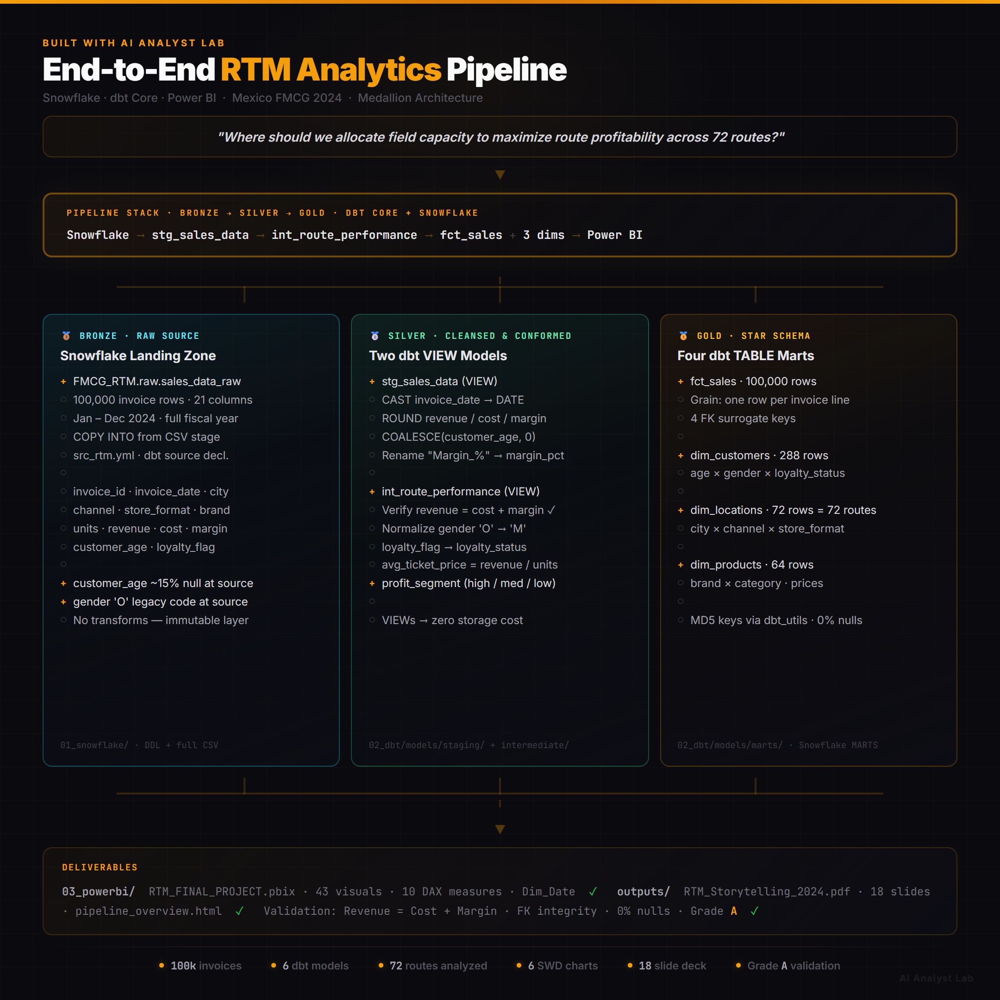

---

## Table of Contents

1. [Project Overview](#1-project-overview)
2. [Medallion Architecture](#2-medallion-architecture)
3. [Repository Structure](#3-repository-structure)
4. [Pipeline Layers](#4-pipeline-layers)
5. [How to Run](#5-how-to-run)
6. [BI & Analysis Deliverables](#6-bi--analysis-deliverables)
7. [RTM Analysis — Key Findings](#7-rtm-analysis--key-findings)
8. [Documentation](#8-documentation)
9. [Validation & Quality](#9-validation--quality)
10. [Stack](#10-stack)

---

## 1. Project Overview

In the FMCG (Fast-Moving Consumer Goods) industry, **Route-to-Market (RTM)** is the
commercial strategy that defines *how* products move from the manufacturer to the
end consumer — which cities are served, through which channels (Offline, Online,
Omnichannel), and via which store formats (Hyper, Super, Express).

Getting RTM right is a margin game. Every route has a cost structure, a drop size
(how much product is delivered per visit), and a profitability profile. A company
with 72 active routes across 8 cities can easily have its best route generating
**20% more gross margin** than its worst — without anyone on the commercial team
knowing which is which, or why.

**This project answers that question end-to-end.**

Starting from 100,000 raw retail invoices covering the full 2024 fiscal year
across Mexico, it builds a complete analytics pipeline that:

- **Cleanses and structures** the raw transactional data into a validated, trusted data model
- **Quantifies every route** by revenue, gross margin, Cost-to-Serve, and drop size
- **Identifies the star routes** worth protecting and the critical routes leaking margin
- **Detects the channel shift** from Offline toward Omnichannel happening in H2 2024
- **Delivers the answer** to the RTM leadership team in a Power BI executive dashboard
  and two presentation-ready PDF decks

The end result is not just a dashboard — it is a **decision-ready analytical product**:
the RTM team knows exactly which routes to scale, which to restructure, and what a
5% migration from Offline to Omnichannel is worth in recovered margin.

### Dataset at a glance

| Attribute | Value |
|---|---|
| Source | Mexico FMCG Retail Sales Customer Inventory (2024) |
| Rows | 100,000 invoice lines |
| Period | January – December 2024 |
| Cities | 8 (CDMX, Monterrey, Guadalajara, Puebla, Queretaro, Leon, Merida, Tijuana) |
| Channels | 3 (Offline, Online, Omnichannel) |
| Store formats | 3 (Hyper, Super, Express) |
| Unique routes | 72 (city × channel × format) |
| Total revenue | MXN $118,005,404 |
| Avg gross margin | 19.34% |
| Avg Cost-to-Serve | 80.0% |
| Loyalty member share | 29.72% of transactions |

---

## 2. Medallion Architecture

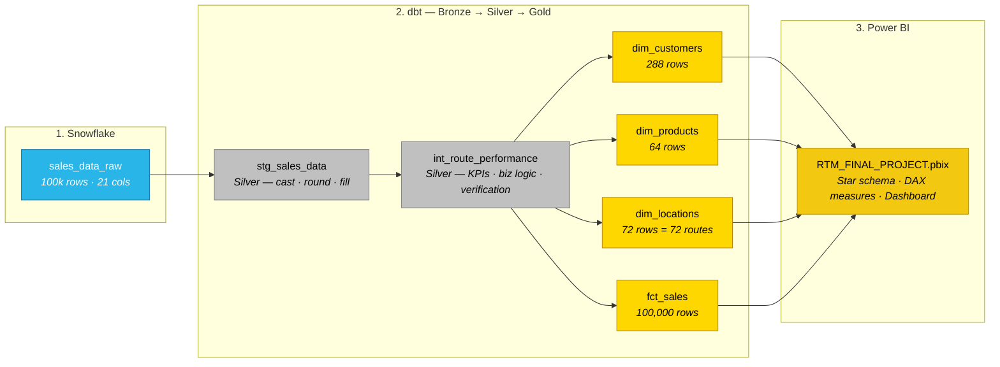

| Tier | Folder | Snowflake Schema | Purpose |
|---|---|---|---|
| 🥉 **Bronze** | `01_snowflake/` | `raw` | Raw operational data, immutable landing zone |
| 🥈 **Silver** | `02_dbt/models/staging/` + `intermediate/` | `STAGING` · `INTERMEDIATE` | Type casting, null handling, business logic, KPI derivation |
| 🥇 **Gold** | `02_dbt/models/marts/` | `MARTS` | Star schema (3 dims + 1 fact), analytics-ready |
| 💠 **BI** | `03_powerbi/` | — | DAX measures, Dim_Date, dashboards |

### Full Pipeline Schema

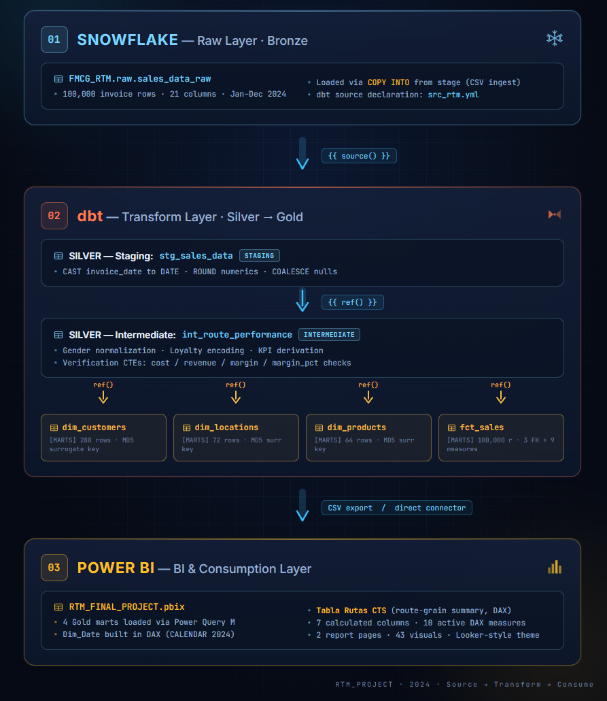

> End-to-end view of every model, transformation, column, and relationship across all three layers.
> See [`schema_RTM_project.md`](schema_RTM_project.md) for the complete written reference.

### Architecture Overview — Snowflake → dbt → Power BI

```
┌─────────────────────────────────────────────────────────────────────────────┐
│  01 SNOWFLAKE — Raw Layer (Bronze)                                          │
│  ┌─────────────────────────────────────────────────────────────────────────┐│
│  │  FMCG_RTM.raw.sales_data_raw                                            ││
│  │  • 100,000 invoice rows · 21 columns · Jan–Dec 2024                     ││
│  │  • Loaded via COPY INTO from stage (CSV ingest)                         ││
│  │  • dbt source declaration: src_rtm.yml                                  ││
│  └──────────────────────────────┬──────────────────────────────────────────┘│
└─────────────────────────────────┼───────────────────────────────────────────┘
                                  │ {{ source() }}
                                  ▼
┌─────────────────────────────────────────────────────────────────────────────┐
│  02 dbt — Transform Layer (Silver → Gold)                                   │
│  ┌─────────────────────────────────────────────────────────────────────────┐│
│  │  🥈 SILVER — Staging                                                     ││
│  │  stg_sales_data [STAGING schema]                                         ││
│  │  • CAST invoice_date to DATE · ROUND numerics · COALESCE nulls           ││
│  └────────────────────────────────┬────────────────────────────────────────┘│
│                                   │ {{ ref() }}                             │
│  ┌────────────────────────────────▼────────────────────────────────────────┐│
│  │  🥈 SILVER — Intermediate                                                ││
│  │  int_route_performance [INTERMEDIATE schema]                             ││
│  │  • Gender normalization · Loyalty encoding · KPI derivation              ││
│  │  • Verification CTEs: cost / revenue / margin / margin_pct checks        ││
│  └───────────────────┬────────┬────────┬────────┬──────────────────────────┘│
│                      │ref()  │ref()   │ref()   │ref()                       │
│  ┌───────────────────▼┐ ┌────▼───────┐ ┌───────▼──┐ ┌─────────────────────┐│
│  │ 🥇 dim_customers   │ │dim_locations│ │dim_products│ │   fct_sales         ││
│  │ [MARTS] 288 rows  │ │[MARTS] 72 r │ │[MARTS] 64r │ │ [MARTS] 100,000 r   ││
│  │ MD5 surrogate key │ │MD5 surr key │ │MD5 surr key│ │ 3 FK + 9 measures   ││
│  └───────────────────┘ └────────────┘ └───────────┘ └─────────────────────┘│
└─────────────────────────────────┼───────────────────────────────────────────┘
                                  │ CSV export / direct connector
                                  ▼
┌─────────────────────────────────────────────────────────────────────────────┐
│  03 POWER BI — BI & Consumption Layer                                       │
│  ┌─────────────────────────────────────────────────────────────────────────┐│
│  │  RTM_FINAL_PROJECT.pbix                                                 ││
│  │  • 4 Gold marts loaded via Power Query M                                ││
│  │  • Dim_Date built in DAX (CALENDAR 2024)                                ││
│  │  • Tabla Rutas CTS (route-grain summary, DAX)                           ││
│  │  • 7 calculated columns · 10 active DAX measures                        ││
│  │  • 2 report pages · 43 visuals · Looker-style theme                     ││
│  └─────────────────────────────────────────────────────────────────────────┘│
└─────────────────────────────────────────────────────────────────────────────┘
```

---

## 3. Repository Structure

```
DBT-MEXICO-FMCG-RTM-PROJECT/
│
├── 01_snowflake/                    ← Step 1: raw landing zone
│   ├── ddl/
│   │   └── sales_data_raw.sql       ← CREATE TABLE DDL with column comments
│   └── sample_data/
│       ├── sales_data_raw.csv       ← full source (100,000 rows)
│       └── sales_data_sample.csv    ← 50-row quick-look sample
│
├── 02_dbt/                          ← Step 2: Bronze → Silver → Gold transforms
│   ├── models/
│   │   ├── staging/
│   │   │   ├── src_rtm.yml          ← 🥉 Bronze source declaration
│   │   │   └── stg_sales_data.sql   ← 🥈 Silver — cast, round, fill nulls
│   │   ├── intermediate/
│   │   │   └── int_route_performance.sql  ← 🥈 Silver — verify calcs, derive KPIs
│   │   └── marts/                   ← 🥇 Gold — star schema
│   │       ├── dim_customers.sql    (288 rows)
│   │       ├── dim_locations.sql    (72 rows = 72 routes)
│   │       ├── dim_products.sql     (64 rows)
│   │       └── fct_sales.sql        (100,000 rows)
│   ├── dbt_project.yml
│   ├── packages.yml                 ← dbt_utils dependency
│   └── profiles.yml.template        ← Snowflake connection template
│
├── 03_powerbi/                      ← Step 3: BI consumption layer
│   ├── RTM_FINAL_PROJECT.pbix       ← Power BI semantic model + dashboard
│   ├── PowerQuery_M_Script.m        ← M-script: 4 CSV loads + type casting
│   ├── RTM_Theme.json               ← Looker-style theme (Google Material palette)
│   ├── Data_Dictionary.md           ← Field reference: loaded tables + DAX objects
│   ├── star_schema.html             ← Mermaid ERD (open in browser)
│   └── data/                        ← 4 star-schema CSVs (regenerable)
│       ├── fct_sales.csv
│       ├── dim_customers.csv
│       ├── dim_products.csv
│       └── dim_locations.csv
│
├── docs/
│   ├── rtm_analysis.md              ← Business analysis writeup (6 findings + recs)
│   ├── schema.md                    ← Compact schema cross-reference (all 3 layers)
│   └── diagrams/                    ← Architecture PNG exports
│
├── scripts/
│   ├── build_powerbi_data.py        ← Raw CSV → 4 star-schema CSVs (DuckDB mirror)
│   ├── generate_charts_light.py     ← 6 light-theme SWD chart PNGs
│   └── chart_style.py               ← Shared SWD chart style helpers
│
├── outputs/
│   ├── RTM_Storytelling_2024.marp.md ← Marp source (dark theme, 18 slides)
│   ├── RTM_Storytelling_2024.pdf     ← Executive deck — PDF export
│   ├── RTM_Storytelling_2024.html    ← Executive deck — HTML export
│   └── charts/                       ← 6 light-theme PNG charts
│
├── schema_RTM_project.md            ← ★ Full pipeline schema reference (single source of truth)
├── README.md                        ← this file
├── requirements.txt                 ← duckdb, pandas, matplotlib, numpy
├── .env.template                    ← Snowflake credentials template
└── .gitignore
```

---

## 4. Pipeline Layers

### 🥉 Bronze — Raw Source

| Object | Snowflake Path | Rows | Columns |
|---|---|---|---|
| `sales_data_raw` | `FMCG_RTM.raw.sales_data_raw` | 100,000 | 21 native operational fields |

Raw CSV ingested via `COPY INTO` from a Snowflake stage. Declared to dbt via
`02_dbt/models/staging/src_rtm.yml`. No transformations at this layer.

**Data quality known at source:** `customer_age` ~15% null; `customer_gender` contains
legacy code `'O'` (remapped in Silver); pre-calculated `revenue`/`cost`/`margin`
fields are verified in Silver via CTEs (confirmed delta ≤ MXN $4.87 — floating-point
rounding only).

### 🥈 Silver — Cleansed & Conformed

| Model | Materialization | Transformations |
|---|---|---|
| `stg_sales_data` | VIEW | Cast `invoice_date` → DATE · `ROUND` numerics to 2–4 decimals · `COALESCE(customer_age, 0)` · rename `"Margin_%"` → `margin_pct` |
| `int_route_performance` | VIEW | Verify pre-calc fields (cost / revenue / margin / margin_pct CTEs) · normalize gender (`'O'`→`'M'`) · encode loyalty flag → `loyalty_status` · derive `avg_ticket_price` and `profit_segment` |

### 🥇 Gold — Star Schema

| Model | Grain | Rows | Surrogate Key |
|---|---|---|---|
| `dim_customers` | (customer_age × gender × loyalty_status) | 288 | `customers_key` = MD5(age + gender + loyalty) |
| `dim_locations` | (city × channel × store_format) = one **route** | 72 | `location_key` = MD5(city + channel + format) |
| `dim_products` | (brand × category) | 64 | `product_key` = MD5(brand + category) |
| `fct_sales` | One row per invoice line | 100,000 | FKs to all 3 dims; natural key `invoice_id` |

All surrogate keys are MD5 hashes via `dbt_utils.generate_surrogate_key()`.

### RTM KPIs derived in the pipeline

| KPI | Layer | Formula |
|---|---|---|
| `avg_ticket_price` | 🥈 Silver | `ROUND(revenue / units, 2)` |
| `profit_segment` | 🥈 Silver | `≥ 0.20 → high profit · ≥ 0.10 → medium profit · else low profit` |
| `loyalty_status` | 🥈 Silver | `loyalty_flag = '1' → member` |
| `CTSIndex` | 💠 BI (DAX) | `(cost / revenue) × (1 + lead_time_days / 100)` |
| `DropBucket` | 💠 BI (DAX) | `≥ $1,000 → Healthy · $500–1K → Optimize · < $500 → Critical` |

---

## 5. How to Run

### Prerequisites

```bash
pip install -r requirements.txt          # duckdb, pandas, matplotlib, numpy
```

### Option A — Local pipeline (no Snowflake required)

```bash
# 1. Build the 4 star-schema CSVs (DuckDB mirror of the dbt transformations)
python scripts/build_powerbi_data.py
# → 03_powerbi/data/fct_sales.csv, dim_customers.csv, dim_products.csv, dim_locations.csv

# 2. Generate the 6 SWD-styled charts (light theme)
python scripts/generate_charts_light.py
# → outputs/charts/01_city_revenue.png … 06_format_channel_heatmap.png

# 3. Open the dashboard
# Power BI Desktop → File → Open → 03_powerbi/RTM_FINAL_PROJECT.pbix
```

### Option B — dbt + Snowflake (production path)

```bash
# Copy and fill in the Snowflake profile
cp 02_dbt/profiles.yml.template ~/.dbt/profiles.yml

cd 02_dbt
dbt deps              # install dbt_utils
dbt run               # execute all 6 models (Silver + Gold)
dbt test              # run data quality tests
dbt docs generate     # build documentation site
dbt docs serve        # open docs in browser
```

See [`02_dbt/README.md`](02_dbt/README.md) for the full dbt walkthrough.

---

## 6. BI & Analysis Deliverables

### Dashboard Preview

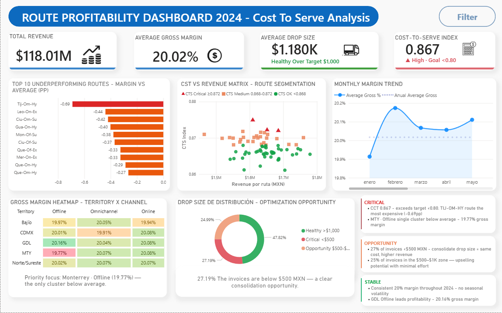

### Chart gallery

| | |
|---|---|
| 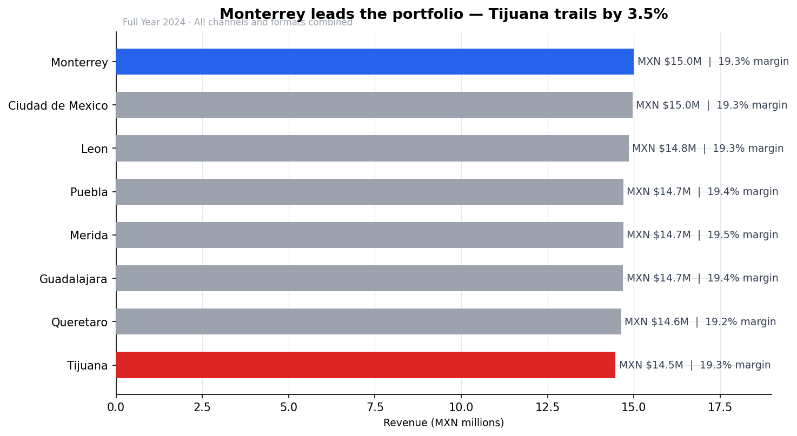 | 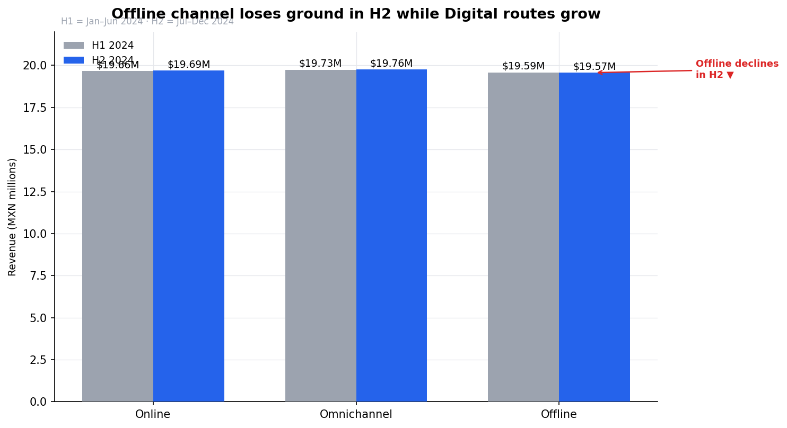 |
| 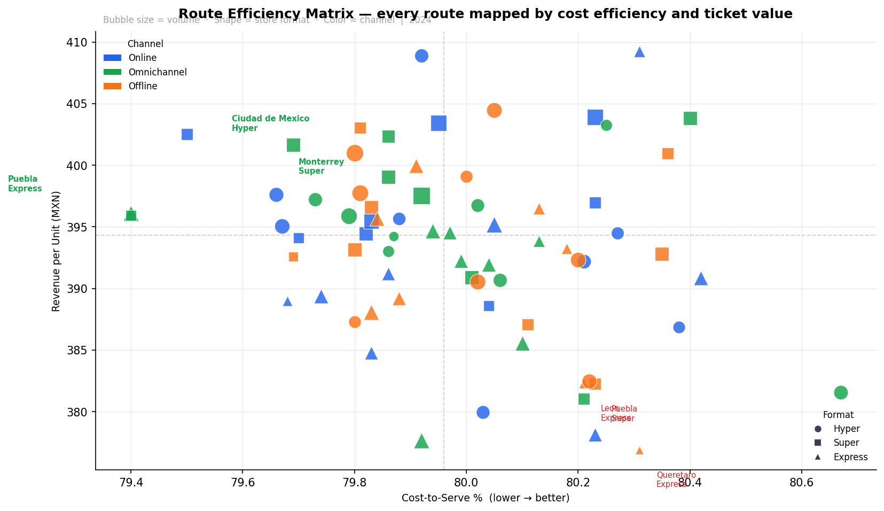 | 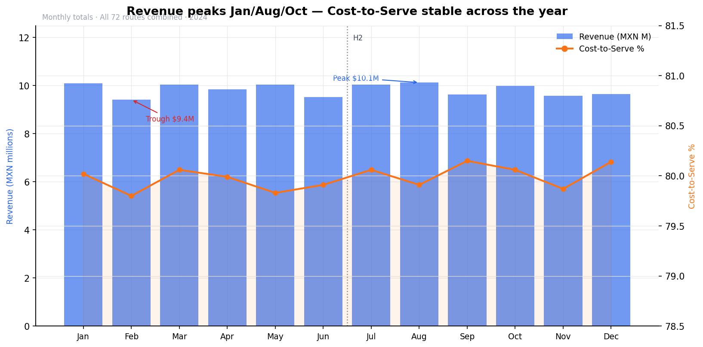 |
| 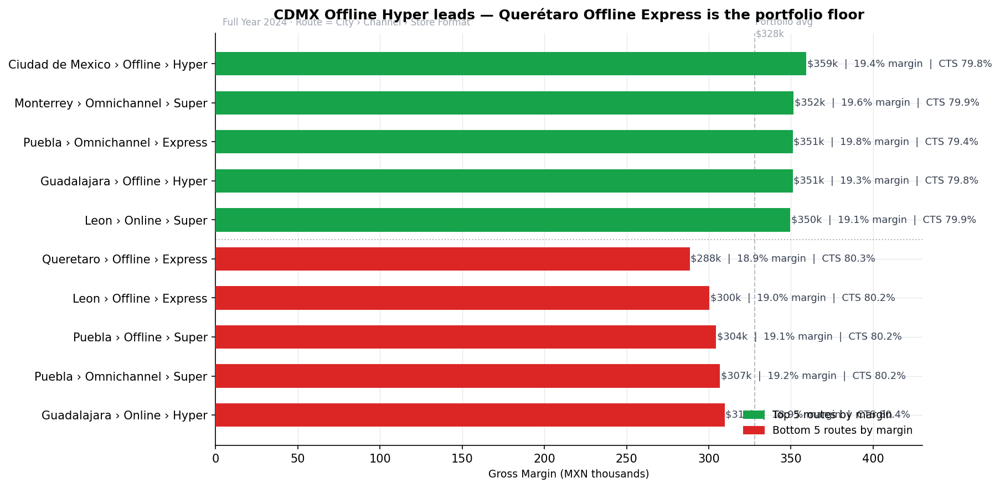 | 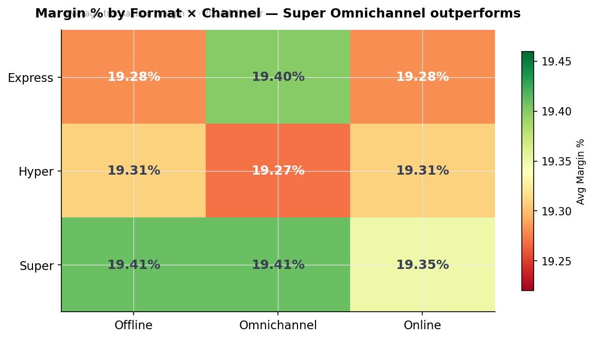 |

### Executive deliverables

| File | Theme | Audience |
|---|---|---|
| [`outputs/RTM_Storytelling_2024.pdf`](outputs/RTM_Storytelling_2024.pdf) | Dark · analytics-dark | Executive storytelling deck (English, 18 slides) |

### Power BI asset pack (`03_powerbi/`)

| File | Purpose |
|---|---|
| **`RTM_FINAL_PROJECT.pbix`** | Production Power BI file — semantic model + dashboards (2 pages · 43 visuals) |
| `PowerQuery_M_Script.m` | M code: 4 CSV loads with full type casting; paste into blank queries |
| `RTM_Theme.json` | Looker-style theme (Google Material palette) — apply via View → Themes |
| `Data_Dictionary.md` | Field reference: loaded columns + DAX calc columns + 10 DAX measures |
| `star_schema.html` | Mermaid ERD — open in any browser |
| `data/` | 4 star-schema CSVs (regenerable via `scripts/build_powerbi_data.py`) |

---

## 7. RTM Analysis — Key Findings

Full analysis, route rankings, and 2025 recommendations: [`docs/rtm_analysis.md`](docs/rtm_analysis.md).

### Portfolio numbers (verified)

| KPI | Value |
|---|---|
| Total Revenue | MXN $118,005,404 |
| Avg Gross Margin % | 19.34% |
| Avg Ticket Price | $393.32 MXN |
| Avg Cost-to-Serve | 80.0% |
| Distinct routes analyzed | 72 |

### Best and worst routes

| Rank | Route | Annual Margin | Margin % | CTS % |
|---|---|---|---|---|
| #1 (star) | CDMX · Offline · Hyper | MXN $359,368 | 19.42% | 79.80% |
| #2 | Monterrey · Omnichannel · Super | MXN $351,669 | 19.61% | 79.92% |
| #3 | Puebla · Omnichannel · Express | MXN $351,179 | 19.84% | 79.40% |
| #71 | León · Offline · Express | MXN $300,468 | 19.04% | 80.21% |
| #72 (critical) | Querétaro · Offline · Express | MXN $288,474 | 18.89% | 80.31% |

**Margin gap:** $71k MXN per year between the star and critical route. Across the 5 weakest
routes: **~$355k MXN of annual margin recoverable** with restructuring.

### Channel shift H1 vs H2 2024

| Channel | Change H2 vs H1 | Signal |
|---|---|---|
| Omnichannel | **+0.18%** | Growing |
| Online | **+0.18%** | Growing |
| Offline | **−0.11%** | Declining |

### Three findings in one sentence each

1. **Geography is not the lever** — the revenue gap between best and worst city is only 3.5%; channel and format matter more.
2. **Offline is losing ground in H2** — a directional signal that will widen without intervention.
3. **Express format is the portfolio drag** — underperforms Hyper and Super on both margin % and average ticket across all channels.

---

## 8. Documentation

| Document | Purpose |
|---|---|
| **[`schema_RTM_project.md`](schema_RTM_project.md)** | **★ Full pipeline schema — Snowflake DDL · dbt layer-by-layer columns · Power BI DAX layer · star schema ERD · data lineage DAG · KPI definitions · validation results** |
| [`docs/rtm_analysis.md`](docs/rtm_analysis.md) | Business analysis writeup: 6 findings, route rankings, seasonality, channel shift, 2025 recommendations |
| [`docs/schema.md`](docs/schema.md) | Compact schema cross-reference (Snowflake → dbt → PBI) with file links |
| [`03_powerbi/Data_Dictionary.md`](03_powerbi/Data_Dictionary.md) | Field-level Power BI reference: loaded tables + DAX calc columns + 10 DAX measures |
| [`02_dbt/README.md`](02_dbt/README.md) | dbt walkthrough: model DAG, how to run, schema config |
| [`01_snowflake/README.md`](01_snowflake/README.md) | Snowflake layer: DDL, data loading, local DuckDB fallback |
| [`03_powerbi/README.md`](03_powerbi/README.md) | Power BI layer: loading approach, DAX showcase, theme instructions |

### Architecture at a glance

| | |
|---|---|
| 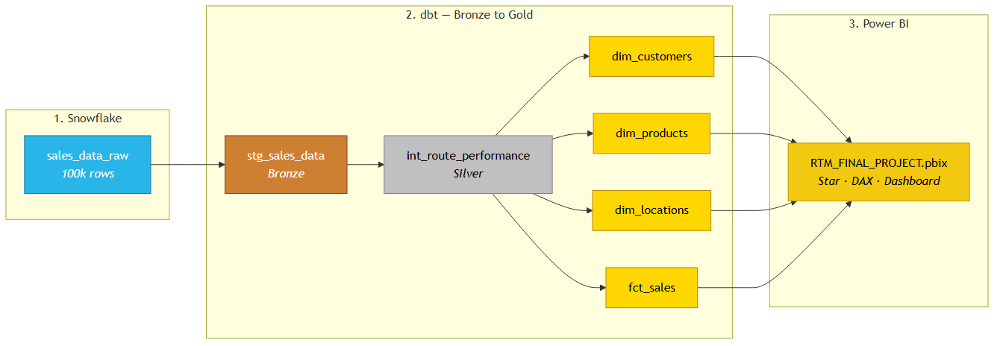 | 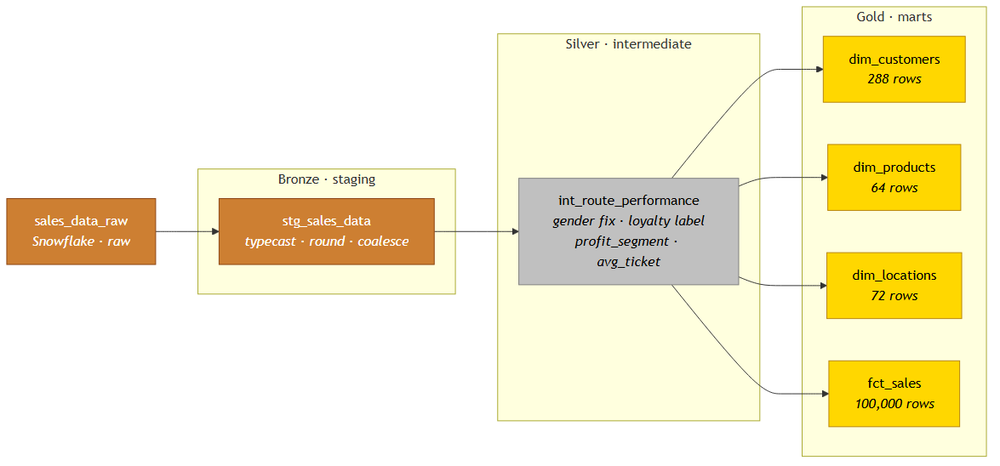 |
| **End-to-end ELT** | **Bronze → Silver → Gold medallion** |

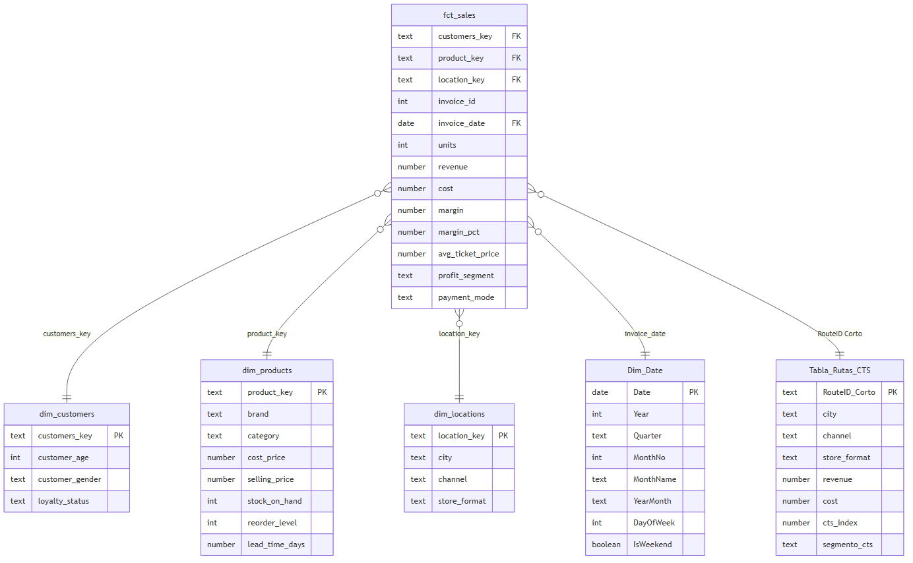

---

## 9. Validation & Quality

All Gold-layer models passed structural, logical, and business-rule validation before Power BI consumption.

| Check | Result |
|---|---|
| Revenue = Cost + Margin | Diff: MXN −$4.87 (floating-point rounding only) ✓ |
| Margin % cross-check (100k rows) | Max delta: 0.000175 ✓ |
| Channel shares sum to 100% | 33.19 + 33.46 + 33.35 = 100% ✓ |
| FK integrity (3 surrogate keys) | 0 orphan rows in `fct_sales` ✓ |
| Null rate post-pipeline | 0% across all Gold columns ✓ |
| Loyalty member share | 29.72% of transactions · 29.88% of revenue ✓ |

**Confidence grade: A** — all structural, logical, and business-rule checks passed.

---

## 10. Stack

| Tool | Layer | Role |
|---|---|---|
| **Snowflake** | 🥉 Bronze | Production data warehouse — raw landing table |
| **dbt Core** | 🥈 Silver + 🥇 Gold | Declarative SQL transformation layer (Staging → Intermediate → Marts) |
| **dbt_utils** | 🥇 Gold | `generate_surrogate_key()` for MD5 dimension keys |
| **DuckDB** | Local dev | In-process pipeline execution — no Snowflake needed for local reproduction |
| **Python + pandas** | Analysis | Build scripts, chart generation, pipeline validation |
| **matplotlib** | Analysis | SWD-styled chart output (light theme) |
| **Power BI Desktop** | 💠 BI | Semantic model, star-schema relationships, end-user dashboard |
| **Power Query (M)** | 💠 BI | CSV load + type casting for all 4 Gold marts |
| **DAX** | 💠 BI | 10 active measures: CTSIndex, Average Gross %, Drop Size Promedio, and more |

---

*Project: `fmcg_rtm_mexico_analytics` · Snowflake + dbt · Data: Jan–Dec 2024 · Architecture: Medallion (Bronze · Silver · Gold · BI)*

**Author:** Héctor Segura · **Data:** Synthetic Mexico FMCG dataset, 100,000 invoice lines · **License:** MIT
